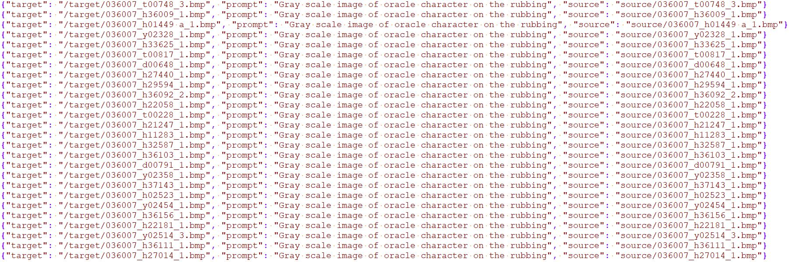
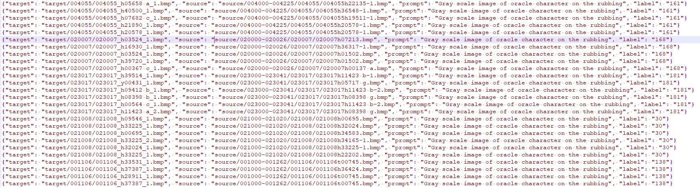

# Diff-Oracle

## Data Preparation

The oracle-241 dataset is publicly available at [STSN](https://github.com/wm-bupt/STSN). However, the [OBC306](https://doi.org/10.1109/ICDAR.2019.00114) and [Oracle-AYNU](https://doi.org/10.1109/ICDAR.2019.00057) datasets are provided by other institutions and are not publicly accessible due to institutional restrictions.

Pseudo handprinted oracle character images can be generated via [CUT](https://github.com/taesungp/contrastive-unpaired-translation) by translating scanned data into handprinted data.

Two JSON files: one is for training, and the other is for generation. 
 - For training, JSON file includes prompts, target (i.e., content) and source (i.e., style) filenames, is presented below:

 - For generation, JSON file includes prompts, labels, target (i.e., content) and source (i.e., style) filenames, is presented below:

## Pretrain Model

The pretrain model "control_sd15_ini.ckpt" can be generated at [ControlNet-Step 3](https://github.com/lllyasviel/ControlNet/blob/main/docs/train.md)

## Training

## Generation
